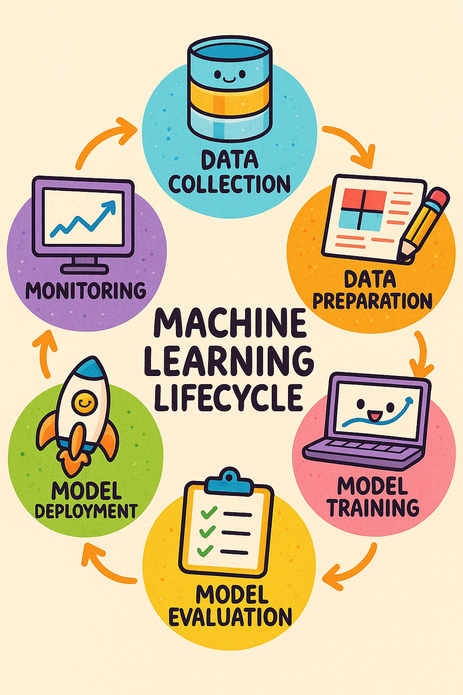
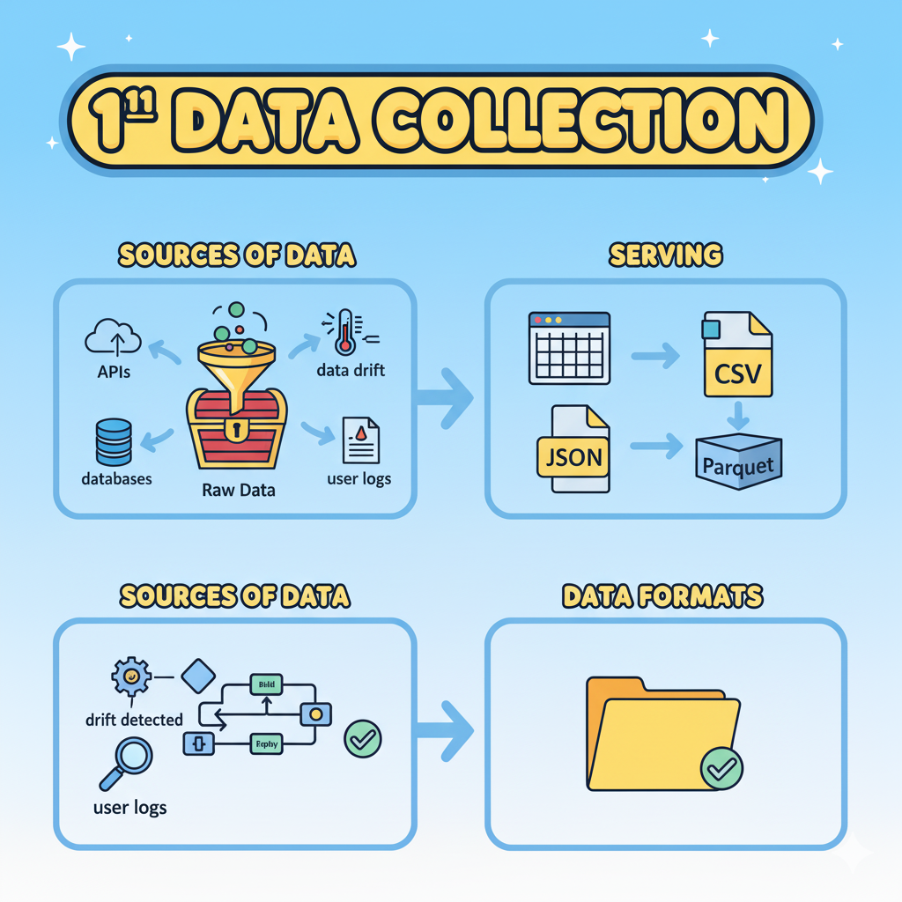
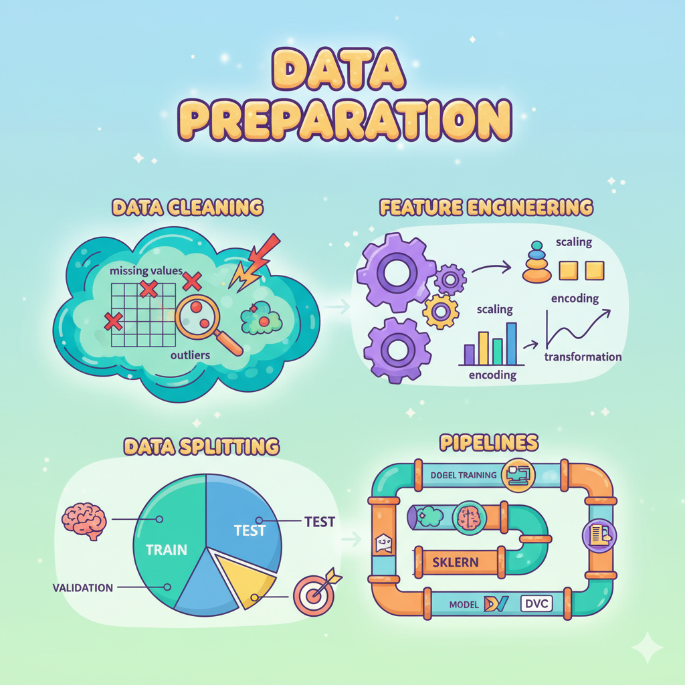
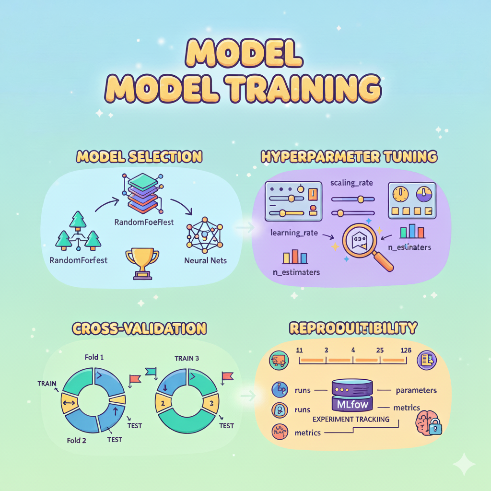
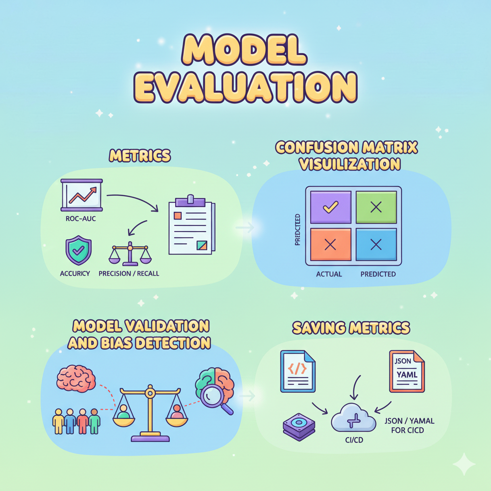
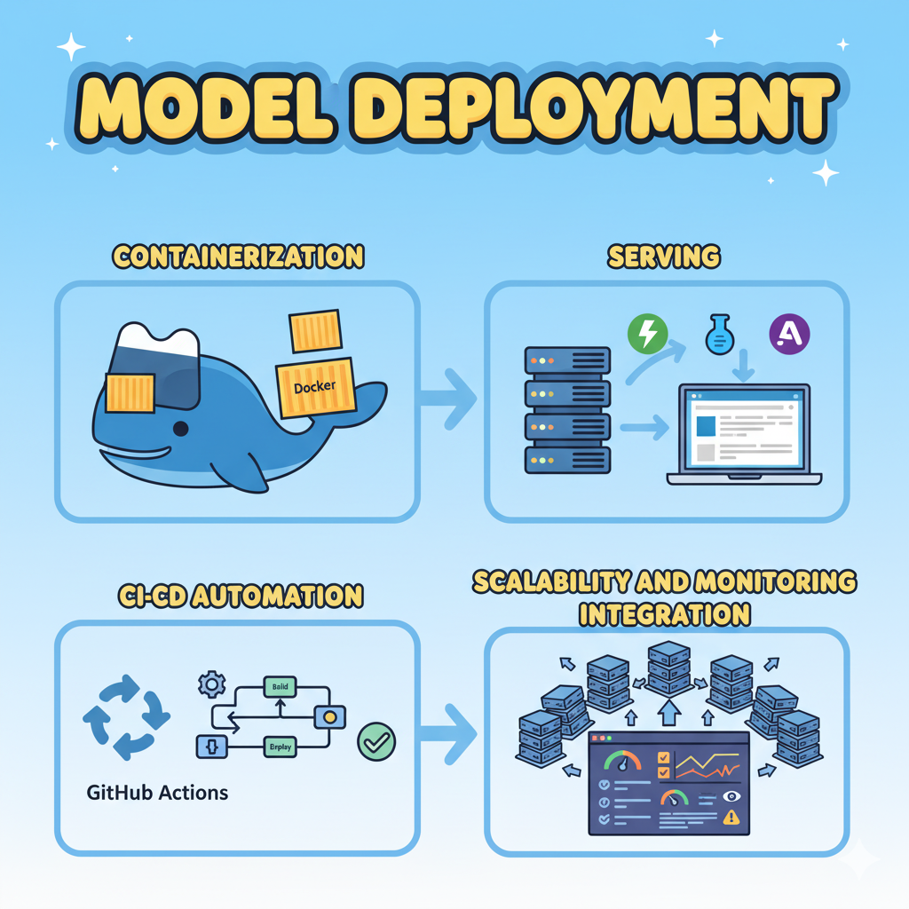
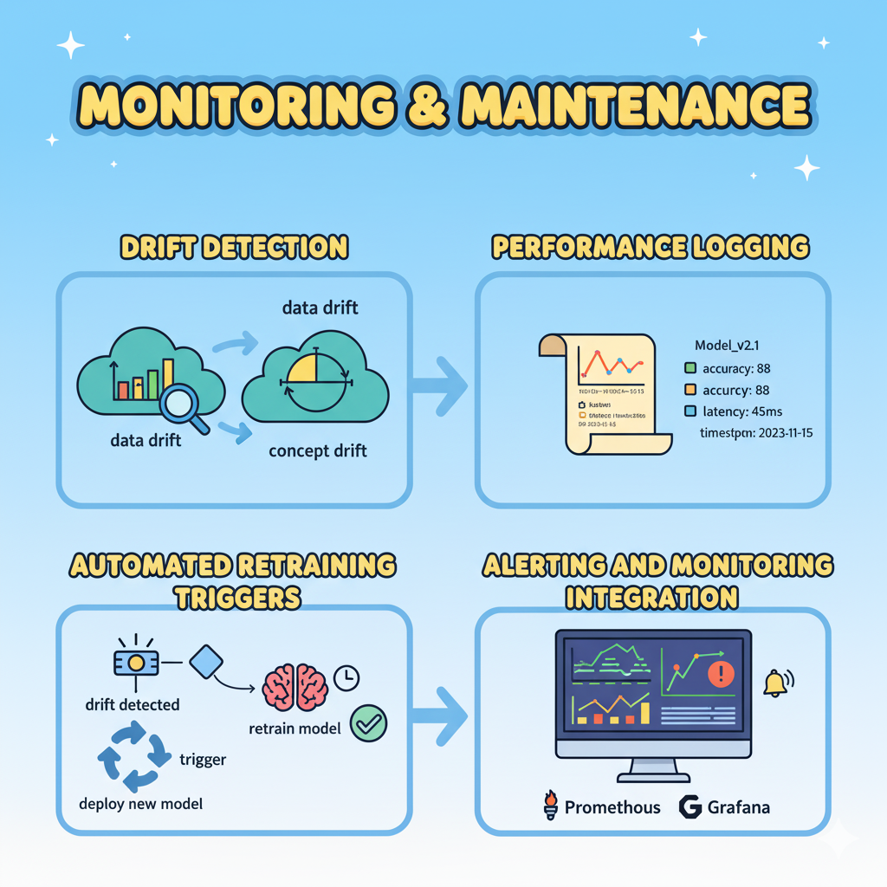

# 📊 Machine Learning lifecycle

**📘 Repository Purpose:**  
This repository serves as a **reference guide** and **hands-on lab** for mastering each stage of the MLOps lifecycle — starting from **Data Collection** to **Model Deployment**.

---

🧠 _"Well-collected data is half the machine learning battle won."_  

# 📊 Data Collection Lifecycle — MLOps Foundation

This section focuses on the **Data Collection** phase — the very first and most crucial step of the **Machine Learning Lifecycle**.

Understanding data sources, formats, storage, and versioning practices ensures a strong foundation for reliable and reproducible ML pipelines.

---

## 🧩 Overview

Data collection is the process of **gathering, storing, and managing** raw data from various sources that will later be transformed into insights by machine learning models.

It involves:

- Identifying **trusted data sources**
- Collecting data efficiently and securely
- Storing it in accessible formats
- Managing **data versions and lineage** for reproducibility

---

## 🎯 Key Components

| Component | Description |
|------------|-------------|
| **Data Sources** | APIs, databases, web scraping, IoT sensors, or user logs. Data can come from structured or unstructured sources. |
| **Data Formats** | Common formats include **CSV**, **JSON**, and **Parquet** — chosen based on storage needs and processing requirements. |
| **Data Storage** | Data is stored in **S3 buckets**, **SQL databases**, **Data Lakes**, or tracked using **DVC** for versioning. |
| **Data Versioning & Access Control** | Use tools like **DVC** to manage dataset versions and control access for teams. |

---

## 🧠 Visual Representation

Below is a conceptual diagram representing the **Data Collection Lifecycle** in MLOps:

---

## 🛠️ Best Practices

1. **Automate data ingestion** using APIs or ETL jobs.
2. **Track dataset versions** using DVC or Git LFS.
3. **Maintain metadata** (source, schema, update frequency).
4. **Secure storage** with encryption and access controls.
5. **Validate incoming data** for schema consistency and anomalies.

---

## 🌐 Example Tools & Technologies

| Purpose | Tool |
|----------|------|
| Data Collection | Python (requests, BeautifulSoup), Kafka, Airbyte |
| Data Storage | AWS S3, PostgreSQL, BigQuery, Delta Lake |
| Versioning | DVC, Git LFS, LakeFS |
| Access Control | IAM Roles, Vault, MinIO Policies |

---

## 🚀 What’s Next?

Next step in the ML lifecycle: **Data Preparation** 🧹

Data preparation transforms raw data into a clean, structured, and usable format for model training.

### 🧩 Key Steps

| Step | Description |
|------|--------------|
| **Data Cleaning** | Handle missing values, detect and remove outliers, and fix inconsistent data types. |
| **Feature Engineering** | Perform scaling (StandardScaler, MinMaxScaler), encoding (OneHotEncoder, LabelEncoder), and domain-specific transformations. |
| **Data Splitting** | Split datasets into **train**, **test**, and **validation** sets to ensure generalization. |
| **Pipelines** | Use  **DVC pipelines** for consistent preprocessing workflows. |

### 🧠 Example Tools
- `pandas`, `numpy` for data manipulation  
- `scikit-learn` for preprocessing and pipelines  
- `DVC` for data versioning and reproducibility  

---

## 🏋️‍♂️ 3️⃣ Model Training

Model training is the process of fitting algorithms to data and optimizing parameters to make accurate predictions.

### 🧩 Key Steps

| Step | Description |
|------|--------------|
| **Model Selection** | Choose from algorithms like **Random Forest**, **XGBoost**, or **Neural Networks** depending on problem complexity. |
| **Hyperparameter Tuning** | Use **GridSearchCV**, **Optuna**, or **Hyperopt** to find optimal configurations. |
| **Cross-Validation** | Evaluate models using **k-fold cross-validation** for robust performance metrics. |
| **Reproducibility** | Track experiments and parameters using **MLflow** for consistent, comparable runs. |

### 🧠 Example Tools
- `scikit-learn`, `xgboost`, `lightgbm`, `tensorflow`, `pytorch`
- `MLflow`, `Weights & Biases`, `DVC experiments`

---

## 📊 4️⃣ Model Evaluation

Model evaluation measures how well your trained model performs on unseen data.

### 🧩 Key Steps

| Step | Description |
|------|--------------|
| **Metrics** | Evaluate using metrics like **Accuracy**, **Precision**, **Recall**, **F1-score**, **ROC-AUC**. |
| **Visualization** | Use confusion matrices, ROC curves, and precision-recall plots for performance insights. |
| **Validation & Bias Detection** | Check for model bias and validate performance across subgroups. |
| **Metrics Storage** | Save metrics in `metrics.json` or `metrics.yaml` for tracking in CI/CD or dashboards. |

### 🧠 Example Tools
- `matplotlib`, `seaborn` for visualization  
- `sklearn.metrics` for evaluation  
- `DVC metrics`, `MLflow metrics` for tracking  

---

## 🚀 5️⃣ Model Deployment

Once trained and validated, the model must be deployed into a production environment for inference.

### 🧩 Key Steps

| Step | Description |
|------|--------------|
| **Containerization** | Package the model using **Docker** for consistent runtime environments. |
| **Serving** | Deploy using **FastAPI**, **Flask**, or **Streamlit** for REST APIs or dashboards. |
| **CI/CD Automation** | Automate testing and deployment via **GitHub Actions**, **GitLab CI**, or **Bitbucket Pipelines**. |
| **Scalability & Monitoring** | Integrate with **Kubernetes**, **AWS ECS**, or **GCP AI Platform** for scalability and uptime. |

### 🧠 Example Tools
- `Docker`, `Kubernetes`, `Minikube`  
- `FastAPI`, `Flask`, `Streamlit`  
- `GitHub Actions`, `Bitbucket Pipelines`, `ArgoCD`

---

## 📈 6️⃣ Monitoring & Maintenance

After deployment, continuous monitoring ensures models stay accurate and reliable in real-world conditions.

### 🧩 Key Steps

| Step | Description |
|------|--------------|
| **Drift Detection** | Detect **data drift** (change in input data distribution) and **concept drift** (change in output relationships). |
| **Performance Logging** | Record inference latency, accuracy decay, and system metrics. |
| **Automated Retraining** | Trigger retraining when performance thresholds fall below target. |
| **Alerting & Dashboards** | Set up real-time alerts and dashboards using **Prometheus** and **Grafana**. |

### 🧠 Example Tools
- `EvidentlyAI`, `WhyLabs`, `Fiddler` for model drift  
- `Prometheus`, `Grafana` for infrastructure monitoring  
- `Airflow`, `Kubeflow Pipelines` for retraining automation  

